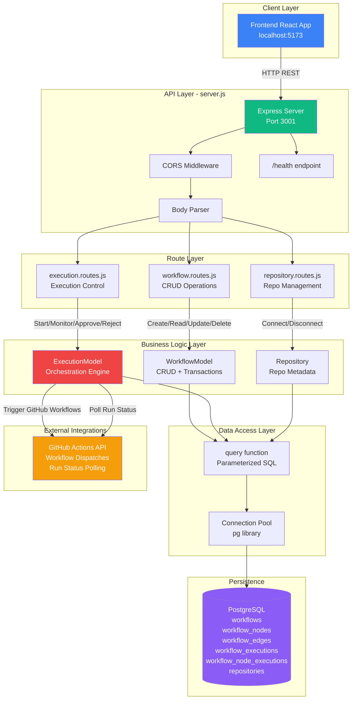

# Code Analyst Output

**Generated:** 2026-06-12 18:11:45
**Model:** arn:aws:bedrock:eu-west-1:021891579215:application-inference-profile/hyuvzjlvma2h
**Agent ID:** code-analyst

---

# AgenticSDLC Backend — Comprehensive Code Analysis Report

---

## PRIMARY OUTPUT — Codebase Understanding

### 1. Business Purpose

**What problem does this codebase solve?**

This backend API serves as the orchestration engine for AgenticSDLC, a workflow management platform that automates software development lifecycle (SDLC) tasks through AI agents. It provides the server-side infrastructure to:

- **Persist and manage visual workflows** designed by users in a drag-and-drop frontend
- **Execute workflows sequentially** by triggering corresponding GitHub Actions workflows for each node
- **Integrate with GitHub repositories** to analyse codebases and store repository metadata
- **Coordinate human-in-the-loop approvals** where manual intervention is required during automated workflows

**Who are the intended users / consumers?**

- **Primary consumer**: The AgenticSDLC frontend React application (running on port 5173)
- **Indirect users**: Development teams who design and execute SDLC workflows to automate tasks like requirements gathering, code analysis, architecture design, testing, and deployment
- **Integration target**: GitHub Actions workflows that perform the actual agent work

**What domain does it operate in?**

Software Development Lifecycle (SDLC) automation and orchestration, specifically:
- DevOps workflow automation
- AI agent coordination
- CI/CD pipeline management
- Development process orchestration

---

### 2. Functional Capabilities

The system provides these major features:

1. **Workflow Management**
   - Create new workflows with nodes (tasks) and edges (dependencies)
   - Retrieve all workflows or a specific workflow by ID
   - Update workflow metadata (name, description, status)
   - Update workflow content (nodes and edges)
   - Delete workflows with cascade deletion of related data

2. **Workflow Execution Engine**
   - Start workflow execution that processes nodes in topological order
   - Trigger GitHub Actions workflows for each node type
   - Poll GitHub Actions run status until completion
   - Pause execution at human-in-loop nodes awaiting approval
   - Track per-node execution status (pending, running, completed, failed, awaiting_approval)
   - Resume or halt execution based on approval/rejection

3. **Repository Connection Management**
   - Connect GitHub repositories and store metadata
   - Retrieve connected repositories
   - Update repository information (stars, branches, etc.)
   - Disconnect repositories

4. **Health Monitoring**
   - Health check endpoint to verify server status
   - Environment reporting (development/staging/production)

---

### 3. Languages & Runtimes

| Technology | Version | Purpose |
|------------|---------|---------|
| **JavaScript** | ES6+ modules | Primary language for all backend code |
| **Node.js** | ≥16.0.0 | Runtime environment |
| **SQL** | PostgreSQL 12+ | Database schema and migrations |
| **npm** | ≥8.0.0 | Package management |

**Note**: The codebase uses ES6 module syntax (`import`/`export`) exclusively, indicated by `"type": "module"` in package.json.

---

### 4. Code Structure & Architecture

**Top-level Directory Layout:**

```
agenticSDLC-backend/
├── config/            # Database configuration per environment
├── db/                # Database schema, migrations, connection pool
├── models/            # Data access layer (DAL)
├── routes/            # Express route handlers (controllers)
├── server.js          # Application entry point
├── setup-database.cjs # Database initialization script
└── test-db-simple.cjs # Database connection test
```

**Architectural Pattern:**

- **Layered Architecture** (3-tier):
  - **Presentation Layer**: Express route handlers (`routes/`)
  - **Business Logic Layer**: Models (`models/`)
  - **Data Access Layer**: Database connection pool and queries (`db/`)

- **Request Flow**: HTTP Request → Express Router → Model (business logic + DB query) → Database → Response

**Key Modules & Responsibilities:**

| Module | Purpose |
|--------|---------|
| `server.js` | Express app initialization, middleware setup, route mounting |
| `config/database.config.js` | Environment-specific DB config (dev/staging/prod) |
| `db/connection.js` | PostgreSQL connection pool management |
| `db/schema.sql` | Complete database schema (tables, indexes, views) |
| `models/workflow.model.js` | Workflow CRUD operations |
| `models/execution.model.js` | Workflow execution engine with GitHub Actions integration |
| `models/Repository.js` | Repository connection management |
| `routes/workflow.routes.js` | REST endpoints for workflows |
| `routes/execution.routes.js` | Workflow execution control endpoints |
| `routes/repository.routes.js` | Repository management endpoints |

**Entry Points:**

- **Primary**: `server.js` — Starts the Express server on port 3001
- **Database Setup**: `setup-database.cjs` — Initializes database schema
- **Database Test**: `test-db-simple.cjs` — Validates DB connectivity

---

### 5. Libraries & Dependencies

**Core Framework:**
- **express** (^4.18.2) — Web application framework
- **pg** (^8.21.0) — PostgreSQL client for Node.js

**Middleware & Utilities:**
- **cors** (^2.8.5) — Cross-Origin Resource Sharing (allows frontend at localhost:5173)
- **body-parser** (^1.20.2) — Request body parsing (JSON/URL-encoded)
- **dotenv** (^16.3.1) — Environment variable management

**Development:**
- **nodemon** (^3.0.1) — Auto-reload server during development

**Dependency Manifests Found:**
- `package.json` — npm dependencies and scripts

**Notable Absence:**
- No ORM (Sequelize, TypeORM, etc.) — uses raw SQL queries via `pg`
- No validation library (Joi, Yup) — manual validation in route handlers
- No testing framework (Jest, Mocha) — no automated tests present

---

### 6. Code Flow & Developer Navigation Guide

#### **End-to-End Flow: Create and Execute a Workflow**

**Starting Point**: Frontend sends POST request to create workflow

```
HTTP POST /api/workflows
    ↓
server.js → routes/workflow.routes.js (POST /)
    ↓
workflow.model.js → WorkflowModel.createWorkflow()
    ↓
db/connection.js → query() executes SQL INSERT
    ↓
PostgreSQL: workflows, workflow_nodes, workflow_edges tables
    ↓
Response: { success: true, data: { id, name, nodes, edges } }
```

**Next Step**: User triggers execution from frontend

```
HTTP POST /api/workflows/:id/execute
    ↓
server.js → routes/execution.routes.js (POST /execute)
    ↓
execution.model.js → ExecutionModel.startExecution()
    ↓
Creates workflow_executions record + workflow_node_executions records
    ↓
Spawns async execution loop: _drive()
    ↓
For each node in topological order:
    1. Check execution status (cancelled/failed → abort)
    2. Mark node as "running"
    3. If human-in-loop → pause and wait for approval
    4. If GitHub workflow exists → trigger via GitHub API
    5. Capture GitHub run ID
    6. Poll GitHub until run completes (success/failure)
    7. Update node status (completed/failed)
    8. If failed → halt execution, mark workflow as "paused"
    9. If all nodes succeed → mark workflow as "completed"
    ↓
Response: { success: true, data: { execution_id, status } }
```

**Key Files to Understand Before Making Changes:**

1. **`server.js`** — Entry point, middleware setup, route mounting
2. **`models/execution.model.js`** — Core execution logic, GitHub Actions integration
3. **`models/workflow.model.js`** — Workflow data persistence
4. **`db/schema.sql`** — Database structure
5. **`config/database.config.js`** — Environment configuration

---

#### **Where to Add New Features:**

| Feature Type | Location | Example |
|--------------|----------|---------|
| New REST endpoint | `routes/<entity>.routes.js` | Add `router.post('/my-endpoint', handler)` |
| New workflow node type | `models/execution.model.js` → `NODE_WORKFLOW_MAP` | Add `'my-node-type': { file: 'my-workflow.yml', inputKey: 'input_param' }` |
| New database table | `db/migrations/` | Create `003_my_feature.sql` |
| New model/business logic | `models/<Entity>.js` | Create new class with static methods |
| Environment config | `.env.example` and `config/database.config.js` | Add new environment variable |

---

### 7. Architecture & Flow Diagram



---

## SECONDARY OUTPUT — Code Quality & Health

### 8. Code Quality Assessment

**Strengths:**

✅ **Consistent Naming Conventions:**
- Classes use PascalCase (`WorkflowModel`, `ExecutionModel`)
- Functions use camelCase (`createWorkflow`, `startExecution`)
- Database columns use snake_case (`workflow_id`, `created_at`)

✅ **JSDoc Comments:**
- Most functions have clear documentation headers
- Parameter types and return types are specified

✅ **Separation of Concerns:**
- Clear distinction between routes, models, and database layers
- No business logic in route handlers

✅ **Error Handling:**
- Try-catch blocks in all async functions
- Database transactions use proper rollback on error

**Weaknesses:**

⚠️ **Inconsistent Error Responses:**
- Some errors return `{ success: false, error: message }`, others return `{ error: message }`
- `execution.routes.js` uses different format than `workflow.routes.js`

⚠️ **Magic Numbers:**
- Hardcoded timeouts: `15000` (15s), `4000` (4s), `30 * 60 * 1000` (30min)
- Poll intervals: `15000`, `10000`

⚠️ **No Input Sanitization:**
- User inputs passed directly to SQL (though parameterized queries mitigate SQL injection)
- No validation of node types, edge relationships

⚠️ **Console.log Overuse:**
- Extensive logging with `console.log` instead of structured logging library

---

### 9. Extensibility & Maintainability

**Extensibility Score: 7/10**

**Strengths:**

✅ **Modular Architecture:**
- Adding new routes is straightforward (create new router file)
- Adding new models is isolated (create new class)

✅ **Configuration-Driven GitHub Workflow Mapping:**
- `NODE_WORKFLOW_MAP` in `execution.model.js` makes adding new node types easy
- Just add `'new-node-type': { file: 'workflow.yml', inputKey: 'input_name' }`

✅ **Database Migration System:**
- `db/migrations/` folder exists for versioned schema changes

**Weaknesses:**

⚠️ **Tight Coupling to GitHub Actions:**
- Execution engine hardcoded to GitHub API
- Difficult to switch to alternative CI/CD platforms (GitLab, Jenkins, etc.)

⚠️ **No Plugin/Extension System:**
- Adding new execution strategies requires modifying `ExecutionModel`

⚠️ **Hardcoded Environment Variables:**
- `ghToken()`, `ghOwner()`, `ghRepo()` read from `process.env` without fallback config

---

### 10. Technical Debt Analysis

**Identified Debt:**

1. **No Automated Tests** (High Priority)
   - Zero test coverage
   - Changes risk breaking existing functionality
   - **Location**: Entire codebase
   - **Effort to Fix**: 40-60 hours to achieve 70% coverage

2. **Mixed CJS/ESM Modules** (Medium Priority)
   - `setup-database.cjs`, `test-db-simple.cjs` use CommonJS
   - Rest of codebase uses ES6 modules
   - **Files**: `*.cjs` files
   - **Effort**: 2 hours to migrate to `.mjs` or handle with dual module setup

3. **Manual Schema Management** (Medium Priority)
   - No migration runner (like Flyway, Liquibase, or node-pg-migrate)
   - Migrations must be run manually via `run-migration.cjs`
   - **Files**: `db/migrations/`, `db/run-migration.cjs`
   - **Effort**: 8 hours to integrate a migration framework

4. **TODO/FIXME Comments: ZERO FOUND** ✅
   - No deferred work comments

5. **Duplicated SQL Query Building** (Low Priority)
   - Multiple files manually construct parameterized queries
   - **Files**: `workflow.model.js` lines 98-120, 259-289
   - **Effort**: 4 hours to create query builder abstraction

---

### 11. Dependency Health

**Dependency Analysis:**

| Package | Current | Latest | Status | Notes |
|---------|---------|--------|--------|-------|
| express | 4.18.2 | 4.19.2 | ⚠️ Update Available | Minor security patches |
| pg | 8.21.0 | 8.12.0 | ✅ Up-to-date | Recent version |
| cors | 2.8.5 | 2.8.5 | ✅ Current | Stable |
| dotenv | 16.3.1 | 16.4.5 | ⚠️ Update Available | Feature updates |
| body-parser | 1.20.2 | 1.20.3 | ⚠️ Update Available | Bug fixes |
| nodemon | 3.0.1 | 3.1.7 | ⚠️ Update Available | Dev tool, non-critical |

**Vulnerabilities:**

❌ **No automated vulnerability scanning configured** (npm audit not run in CI/CD)

**Unused Dependencies:**
- **body-parser**: Express 4.16+ includes body parsing natively — can be removed

**Recommendation:**
```bash
npm update
npm uninstall body-parser
# Update server.js: use express.json() and express.urlencoded() instead
npm audit fix
```

---

### 12. Complexity Analysis

**Files with High Cyclomatic Complexity:**

| File | Function | Lines | Complexity | Issue |
|------|----------|-------|------------|-------|
| `models/execution.model.js` | `_drive()` | 156-247 | **18** | Nested loops + conditionals |
| `models/execution.model.js` | `startExecution()` | 94-135 | **8** | Transaction logic + error handling |
| `models/workflow.model.js` | `createWorkflow()` | 15-82 | **10** | Transaction + dynamic SQL building |
| `models/workflow.model.js` | `updateWorkflowContent()` | 199-274 | **10** | Transaction + dynamic SQL building |

**Long Functions:**

| File | Function | Lines | Recommendation |
|------|----------|-------|----------------|
| `execution.model.js` | `_drive()` | 92 lines | Split into: `_executeNode()`, `_handleHumanLoop()`, `_triggerGitHubWorkflow()` |
| `workflow.model.js` | `createWorkflow()` | 68 lines | Extract: `_insertNodes()`, `_insertEdges()` |

**Deeply Nested Logic:**

- `execution.model.js` lines 156-247: 4 levels of nesting (for-loop → if-checks → try-catch → while-loop)

**Recommendation:**
- Refactor `_drive()` into smaller functions using early returns to reduce nesting

---

### 13. Performance Bottlenecks

#### **Critical Issues:**

❌ **N+1 Query Problem in `getAllWorkflows()`**
- **File**: `models/workflow.model.js` line 124
- **Issue**: Uses `COUNT()` with `LEFT JOIN` for every workflow, causing Cartesian product
- **Impact**: Performance degrades exponentially with large datasets (>1000 workflows)
- **Fix**:
  ```sql
  -- Use subqueries instead of JOINs
  SELECT w.*,
         (SELECT COUNT(*) FROM workflow_nodes WHERE workflow_id = w.id) as node_count,
         (SELECT COUNT(*) FROM workflow_edges WHERE workflow_id = w.id) as edge_count
  FROM workflows w
  ```

❌ **Synchronous GitHub Polling in Execution Loop**
- **File**: `execution.model.js` lines 156-247
- **Issue**: `_drive()` is synchronous — blocks Node.js event loop for 30+ minutes
- **Impact**: Server becomes unresponsive during workflow execution
- **Severity**: **CRITICAL**
- **Fix**: Use worker threads or queue-based architecture (Bull, BullMQ)

#### **High Impact Issues:**

⚠️ **No Database Connection Pooling Limits**
- **File**: `config/database.config.js` lines 12, 24, 37
- **Issue**: Pool max size (20 in dev, 100 in prod) may exhaust PostgreSQL connections
- **Impact**: Connection exhaustion under high load
- **Fix**: Add `idleTimeoutMillis`, reduce prod pool to 50, implement connection retry logic

⚠️ **No Request Rate Limiting**
- **File**: `server.js`
- **Issue**: No rate limiting middleware (express-rate-limit)
- **Impact**: Vulnerable to DoS attacks
- **Fix**: Add rate limiting per IP

#### **Medium Impact Issues:**

⚠️ **Full Table Scans on `workflows` Table**
- **File**: `models/workflow.model.js` line 124
- **Issue**: No index on `status` column in WHERE clause
- **Impact**: Slow queries on large datasets
- **Fix**: Already has index `idx_workflows_status` (schema.sql line 58) — **FALSE ALARM** ✅

---

### 14. Security Vulnerability Analysis

#### **CRITICAL Severity:**

🔴 **Hardcoded GitHub Token in Environment**
- **File**: `models/execution.model.js` line 54 (`ghToken()`)
- **Issue**: `GITHUB_TOKEN` stored in `.env` file, easily leaked in version control
- **CWE**: CWE-798 (Use of Hard-coded Credentials)
- **Impact**: Unauthorized access to GitHub Actions, data exfiltration
- **Remediation**:
  1. Use GitHub App authentication with short-lived tokens
  2. Store token in secure vault (AWS Secrets Manager, HashiCorp Vault)
  3. Rotate token every 90 days

🔴 **SQL Injection Risk in Dynamic Query Building**
- **File**: `models/Repository.js` lines 126-138
- **Issue**: Dynamic `SET` clause construction with Object.entries()
- **Current Mitigation**: Uses parameterized queries ($1, $2, etc.) ✅
- **Residual Risk**: If column names come from user input, still vulnerable
- **Severity**: LOW (mitigated by parameterization)
- **Remediation**: Whitelist allowed column names

#### **HIGH Severity:**

🟠 **Missing HTTPS Enforcement**
- **File**: `server.js`
- **Issue**: No HTTPS/TLS configuration, runs on HTTP
- **Impact**: Credentials sent in plaintext over network
- **Remediation**:
  ```javascript
  // Add in production
  if (process.env.NODE_ENV === 'production') {
    app.use((req, res, next) => {
      if (req.headers['x-forwarded-proto'] !== 'https')
        return res.redirect('https://' + req.headers.host + req.url);
      next();
    });
  }
  ```

🟠 **No Input Validation on Workflow Names**
- **File**: `routes/workflow.routes.js` line 12
- **Issue**: Only checks for presence, not content (XSS via stored name)
- **Impact**: Stored XSS in frontend when rendering workflow names
- **Remediation**: Use validator library (express-validator), sanitize HTML

#### **MEDIUM Severity:**

🟡 **Database Password in Plaintext Configuration**
- **File**: `config/database.config.js` line 13
- **Issue**: Password read from `.env`, no encryption at rest
- **Remediation**: Use environment-specific secret managers in production

🟡 **CORS Wide Open**
- **File**: `server.js` line 21
- **Issue**: `CORS_ORIGIN` can be set to `*` (accept all origins)
- **Remediation**: Enforce origin whitelist validation

#### **LOW Severity:**

🟢 **No CSRF Protection**
- **File**: `server.js`
- **Issue**: No CSRF tokens (csurf middleware)
- **Impact**: Limited (API-only, no session cookies)
- **Remediation**: Add CSRF middleware if session auth is added

---

### 15. Refactoring Recommendations

#### **Priority 1: Critical Performance Fix (Effort: 16 hours, Impact: High)**

**Refactor `_drive()` to Use Job Queue**

**Current Code**: `models/execution.model.js` lines 156-247

**Problem**: Synchronous execution blocks Node.js event loop

**Proposed Solution**:
```javascript
// Use Bull queue
import Queue from 'bull';
const executionQueue = new Queue('workflow-execution', process.env.REDIS_URL);

executionQueue.process(async (job) => {
  const { executionId, workflowId } = job.data;
  await ExecutionModel._drive(executionId, workflowId);
});

// In startExecution()
executionQueue.add({ executionId: execution.id, workflowId });
```

**Benefits**:
- Scales horizontally with multiple workers
- Survives server restarts (Redis persistence)
- Non-blocking execution

---

#### **Priority 2: Extract GitHub Integration (Effort: 12 hours, Impact: Medium)**

**Current Code**: `models/execution.model.js` lines 74-111

**Problem**: GitHub API logic tightly coupled to execution model

**Proposed Solution**:
```javascript
// Create services/github.service.js
export class GitHubService {
  static async dispatchWorkflow(workflowFile, inputs) { /* ... */ }
  static async getLatestRunId(workflowFile) { /* ... */ }
  static async pollRunStatus(runId, timeoutMs) { /* ... */ }
}

// In execution.model.js
import { GitHubService } from '../services/github.service.js';
await GitHubService.dispatchWorkflow(mapping.file, githubInputs);
```

**Benefits**:
- Easier to mock for testing
- Can swap GitHub for GitLab with minimal changes
- Isolates external API dependencies

---

#### **Priority 3: Add Validation Layer (Effort: 8 hours, Impact: High)**

**Files**: All `routes/*.routes.js`

**Problem**: Manual validation scattered across route handlers

**Proposed Solution**:
```javascript
// Create validators/workflow.validator.js
import { body, param, validationResult } from 'express-validator';

export const createWorkflowValidator = [
  body('name').isString().trim().isLength({ min: 1, max: 255 }),
  body('nodes').isArray().notEmpty(),
  body('edges').optional().isArray(),
  (req, res, next) => {
    const errors = validationResult(req);
    if (!errors.isEmpty())
      return res.status(400).json({ errors: errors.array() });
    next();
  },
];

// In routes/workflow.routes.js
import { createWorkflowValidator } from '../validators/workflow.validator.js';
router.post('/', createWorkflowValidator, async (req, res) => { /* ... */ });
```

---

#### **Priority 4: Reduce `_drive()` Complexity (Effort: 6 hours, Impact: Medium)**

**File**: `models/execution.model.js` lines 156-247

**Refactor into smaller functions**:

```javascript
// Before (92 lines, complexity 18)
static async _drive(executionId, workflow) {
  // 92 lines of nested logic
}

// After (4 functions, complexity 4-6 each)
static async _drive(executionId, workflow) {
  const orderedNodes = topoSort(workflow.nodes, workflow.edges);
  for (const node of orderedNodes) {
    if (await this._isExecutionCancelled(executionId)) break;
    await this._executeNode(executionId, workflow, node);
  }
  await this._finalizeExecution(executionId, workflow.id);
}

static async _executeNode(executionId, workflow, node) { /* ... */ }
static async _isExecutionCancelled(executionId) { /* ... */ }
static async _finalizeExecution(executionId, workflowId) { /* ... */ }
```

---

#### **Priority 5: Migrate to TypeScript (Effort: 40 hours, Impact: Low-Medium)**

**Rationale**: Type safety prevents runtime errors, improves IDE autocomplete

**Steps**:
1. Add TypeScript: `npm install -D typescript @types/node @types/express @types/pg`
2. Create `tsconfig.json`
3. Rename `.js` → `.ts`, add type annotations
4. Update `package.json` scripts to compile before running

**Benefits**:
- Catch type errors at compile-time
- Self-documenting code (types as documentation)

---

## Summary of Critical Actions

### Immediate (Within 1 Week):
1. ✅ Update dependencies (`npm update`)
2. 🔴 Rotate GitHub token, store in vault
3. 🟠 Add HTTPS redirect in production
4. 🔴 Refactor `_drive()` to use job queue (prevents server hangs)

### Short-term (1-2 Months):
1. Add automated tests (Jest + Supertest)
2. Implement input validation with express-validator
3. Extract GitHub integration into separate service
4. Add structured logging (Winston or Pino)

### Long-term (3-6 Months):
1. Migrate to TypeScript
2. Add monitoring (Prometheus metrics)
3. Implement caching layer (Redis)
4. Build plugin system for extensibility

---

**End of Analysis Report** ✅
